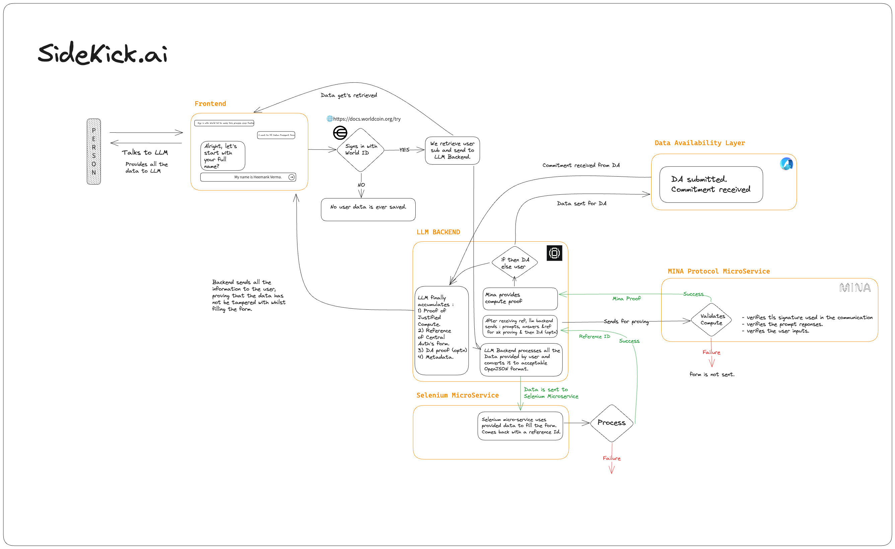

# sidekick.ai



## Index 📄

- [sidekick.ai](#sidekickai)
  - [Index 📄](#index-)
  - [System Components ⚙️](#system-components-️)
  - [Process Flow 🌊](#process-flow-)
  - [Key Benefits 🎁](#key-benefits-)
  - [Targetting Bounties 🏆](#targetting-bounties-)
  - [Deployed Contracts (MINA 🟠)](#deployed-contracts-mina-)
  - [DA Config (AVAIL 🔵)](#da-config-avail-)

## System Components ⚙️

1. **LLM Integration**

   - Integrated with a Selenium backend
   - Directly fills forms on government websites

2. **User Interaction**

   - After form filling, users choose whether to reveal certain details
   - Revealed details can be used for future automatic form filling

3. **Blockchain Integration**

   - Utilizes a Mina smart contract for on-chain proof and verification
   - FormVerifier contract maintains the state of verified forms

4. **Data Management**

   - MerkleMapping system keeps the FormVerifier contract state up-to-date
   - Revealed data and commitments are sent to Avail for future use

5. **Security and Verification**
   - System is tamper-proof due to blockchain integration
   - LLM verifiability achieved by checking final hashed values during form submission

## Process Flow 🌊

1. LLM fills the form on the government website using Selenium
2. User reviews the filled form and decides on data revelation
3. Form input is sent to the Mina contract method for on-chain proof and verification
4. MerkleMapping is updated to reflect the latest state in the FormVerifier contract
5. If user chooses to reveal data:
   - Data and commitment are sent to Avail
   - Revealed data becomes available for future form filling
6. Final hashed values are verified during form submission, ensuring LLM accuracy

## Key Benefits 🎁

- Automated form filling with LLM intelligence
- Blockchain-based verification for enhanced security
- User control over data revelation
- Efficient future form filling using previously revealed data
- Tamper-proof system architecture
- Simple LLM verification process

## Targetting Bounties 🏆

- **Worldcoin** : Best Public Goods Use Case
- **Gaia** : Build a Public Good Integration with web3 AI
- **MINA** : Best Mina application.

## Deployed Contracts (MINA 🟠)

- `Form Verifier` : B62qknETsYf9pg25H23w47QPHNbHUY4mEk7vT4xF7zBjbSSmEa1Wgq2
- `Contract deploy transaction` : 5JtwW6tezWbJZMMsGRGenNPGWqYrKmn6bPSXsBWJpXnWDFBXzrsg
- `Form Verification Txn (TEST)` : 5JuCiLto3cRgmCQ2V8j5swHMANtBWj5XJuwtMLBFqk6CsPcJnE8F
- `Form Verification Fetch result (TEST)` : 5Juzuqgrn5AMxTTXHdSKiND1kR2SExSXK5vqf9skwnqeNcuuZuQS

## DA Config (AVAIL 🔵)

- `Avail Account Public Key` : 5EcPiksgkARM1c5YxnZ6uuHHSnZ2VEBFqkY8tktGK1jV7cut

App Creation Txn :

```sh
Transaction success. Your info is
{
    "key": "sidekick",
    "owner": "5EcPiksgkARM1c5YxnZ6uuHHSnZ2VEBFqkY8tktGK1jV7cut",
    "id": "103"
}

Block ID : 0x1b9514e52fead5c52a8c787d0d84cc560be3374cba0fd212519722159e48ee34
```
